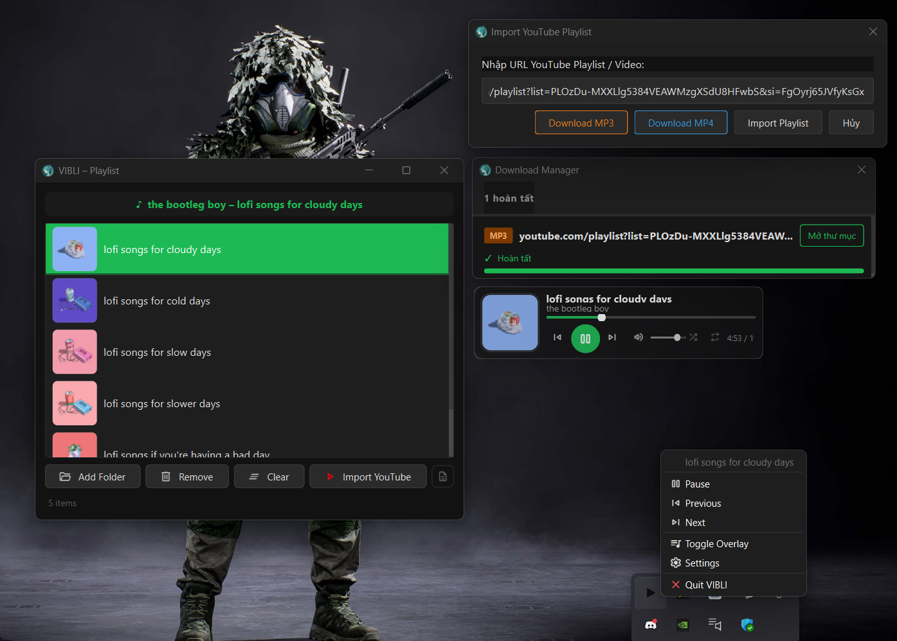

<div align="center">


# VIBLI

**A lightweight background music & video player with a floating mini player.**  
Plays local files and streams YouTube playlists — always on top, always in reach.

[](https://github.com)
[](https://www.qt.io)
[](LICENSE)

</div>

---

## ✨ Features

| | |
|---|---|
| 🎵 **Local playback** | MP3, FLAC, WAV, OGG, AAC, M4A, OPUS, WMA, AIFF, APE + MP4, MKV, AVI, MOV, WEBM… |
| 📺 **YouTube streaming** | Import any YouTube playlist via yt-dlp, stream without downloading |
| ⬇️ **Download** | Save playlist as MP3 or MP4 with embedded thumbnail & metadata |
| 🪟 **Floating Mini Player** | Always-on-top overlay, drag anywhere on screen |
| 🔔 **System Tray** | Play / Pause / Skip without opening any window |
| 🔀 **Shuffle & Repeat** | None / One / All modes |
| 💾 **Auto-save playlist** | Playlist is restored automatically on next launch |
| 📋 **Download Manager** | Track download progress, speed, ETA — cancel anytime |

---

## 📸 Screenshots

<div align="center">

</div>

---

## 🚀 Getting Started

VIBLI runs entirely in the **system tray** — no window pops up on launch.

| Action | Result |
|---|---|
| Click tray icon | Toggle Mini Player overlay |
| Double-click tray icon | Open playlist window |
| Right-click tray icon | Quick controls menu |

### Playing local files
1. Open the playlist window (double-click tray icon)
2. Click **Add Folder** — VIBLI scans all supported audio/video files recursively
3. Double-click any track to start playing

### Streaming a YouTube playlist
1. Click **Import YouTube** in the playlist window
2. Paste a YouTube playlist URL
3. Click **Import Playlist** — tracks appear as they load

### Downloading a playlist
1. Click **Import YouTube**, paste a URL
2. Choose **⬇ Download MP3** or **⬇ Download MP4**
3. Select an output folder — the Download Manager shows live progress

---

## 💻 System Requirements

| | |
|---|---|
| **OS** | Windows 10 / 11 (64-bit) |
| **Runtime** | Included in the release package (Qt DLLs, yt-dlp, ffmpeg) |
| **Codecs** | For MKV / FLAC / OPUS: install [LAV Filters](https://github.com/Nevcairiel/LAVFilters/releases) or [K-Lite Codec Pack](https://codecguide.com/download_kl.htm) |

> **No installation required.** Just unzip the release and run `VIBLI.exe`.

---

---

<details>
<summary><b>🛠️ Developer Guide</b></summary>

<br>

## Prerequisites

### Qt 6

Download from https://www.qt.io/download-qt-installer and install:

| Component | Required |
|---|---|
| Qt 6.x → MinGW 64-bit | ✅ |
| Qt 6.x → Qt Multimedia + MultimediaWidgets | ✅ |
| Developer Tools → MinGW 13.x 64-bit | ✅ |
| Developer Tools → CMake + Ninja | ✅ |

> This project targets **Qt 6.11.0** installed at `D:\data\qt`.  
> If your Qt is elsewhere, update `CMAKE_PREFIX_PATH` in `CMakePresets.json`.

---

## Debug Build

```powershell
# Add tools to PATH
$env:PATH = "D:\data\qt\Tools\mingw1310_64\bin;D:\data\qt\Tools\Ninja;D:\data\qt\Tools\CMake_64\bin;$env:PATH"

# Configure + Build
cmake --preset default
cmake --build build --parallel
```

Run:
```powershell
$env:PATH = "D:\data\qt\6.11.0\mingw_64\bin;D:\data\qt\Tools\mingw1310_64\bin;$env:PATH"
.\build\VIBLI.exe
```

---

## Release Build

```powershell
powershell -ExecutionPolicy Bypass -File tools\Release.ps1
```

**Output:**
- `deploy\VIBLI.exe` — portable, ready to zip and ship
- `dist\VIBLI_Setup_x.y.z.exe` — installer (requires [Inno Setup 6](https://jrsoftware.org/isdl.php))

**Options:**
```powershell
-SkipBuild       # Repackage only, skip rebuild
-SkipInstaller   # Skip installer creation
-Version "2.0.0" # Override version string
```

### Bumping the version

Edit **one line** in `CMakeLists.txt`:
```cmake
project(VIBLI VERSION 1.2.0 LANGUAGES CXX)
```
CMake propagates the version to the binary, installer, and output filenames automatically.

---

## Project Structure

```
src/
├── main.cpp                   # App entry, coordinator wiring
├── core/
│   ├── AudioPlayer            # Qt Multimedia playback engine
│   ├── PlaylistManager        # Track list, shuffle / repeat logic
│   ├── YtDlpService           # yt-dlp process wrapper, stream URL resolver, downloader
│   ├── PlaylistImporter       # YouTube playlist import pipeline
│   ├── MediaCache             # Disk cache: thumbnails + stream URLs (6h TTL)
│   ├── ThumbnailCache         # In-memory LRU thumbnail cache (max 30 images)
│   ├── PlaylistPersistence    # Save / restore playlist as JSON
│   └── LogService             # Structured logging with dedup
├── ui/
│   ├── MiniPlayer             # Floating overlay player
│   ├── MainWindow             # Playlist window
│   ├── DownloadManagerDialog  # Download progress UI
│   ├── PlaylistImportDialog   # YouTube URL input dialog
│   ├── PlaylistModel          # QAbstractListModel for the playlist view
│   ├── PlaylistDelegate       # Custom item renderer
│   ├── LogViewerDialog        # In-app log viewer
│   └── LoadingOverlay         # Spinner overlay during import
└── tray/
    └── TrayManager            # System tray icon & context menu
```

---

## Architecture Notes

- **No window on startup** — the app lives in the system tray; windows are shown on demand.
- **YouTube coordinator** lives in `main.cpp`: listens to `currentTrackChanged` → calls `resolveStreamUrl` → feeds the URL to `AudioPlayer`. Retry logic (up to 2 attempts) and format fallback (m4a → webm → best) are handled here.
- **Two-layer cache**: in-memory `QMap` for instant hits + `MediaCache` on disk for cross-session persistence.
- **Download pipeline**: `YtDlpService::downloadMedia()` runs yt-dlp with `--embed-thumbnail --embed-metadata`, parses stdout line-by-line for progress/speed/ETA/phase transitions (downloading → converting → embedding).

</details>

---

<div align="center">
  <sub>Built with ❤️ using Qt 6 · yt-dlp · ffmpeg</sub>
</div>
